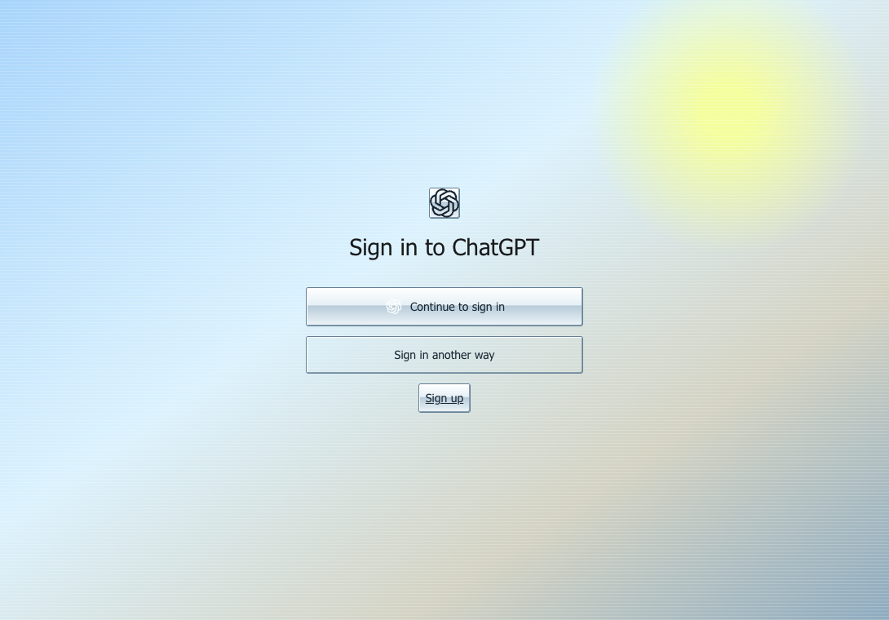

# 小白使用说明

这个项目的目标是：除了说话，什么都不用学。

## 第一次

把下面整句话发给 Codex：

> 请安装这个 Skill，安装完成后告诉我：https://github.com/pingfanfan/dream-skin-studio/tree/main/skills/dream-skin-studio

只需要安装一次。

## 换现成皮肤

以后直接对 Codex 说：

> 给我换成拨号聊天室皮肤和配套桌宠。

也可以说“晨雾气泡”“夜光苔原”或“纸片轨道站”。皮肤和配套桌宠会一起更换，不需要分两次操作。

## 自己描述一种感觉

没有中意的就说：

> 我要一套温暖、安静的原创皮肤和配套桌宠，参考这个链接：https://example.com/reference

链接只用于理解颜色、气氛、材质和构图。来源或授权不明确时，项目不会照搬角色、Logo、界面或他人的图片，而会重新制作原创版本。

## 换一个或恢复

> 换一个。

> 恢复原样。

“恢复原样”会一起移除这个项目添加的皮肤、桌宠和后台服务，不会改写 Codex 官方应用文件。

## 实际效果

这张图来自刚下载的官方 Codex 临时副本，使用全新的隔离资料目录，不是用户的日常 Codex：

这是同时出现的透明桌宠窗口：

遇到任何失败，Skill 应明确告诉你没有换成功，不能只说“已经完成”。
